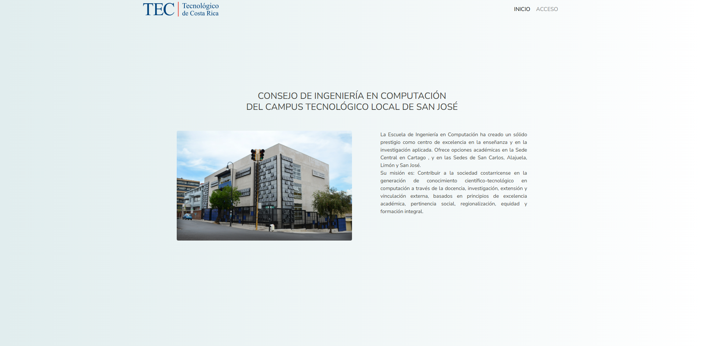
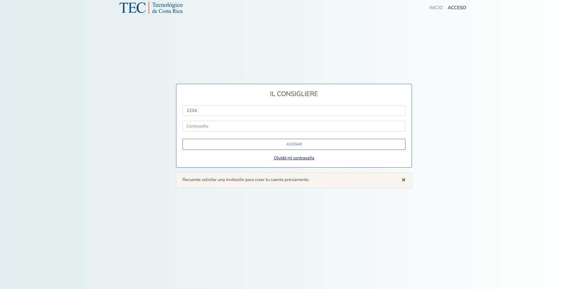
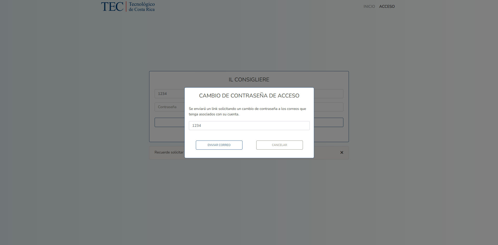
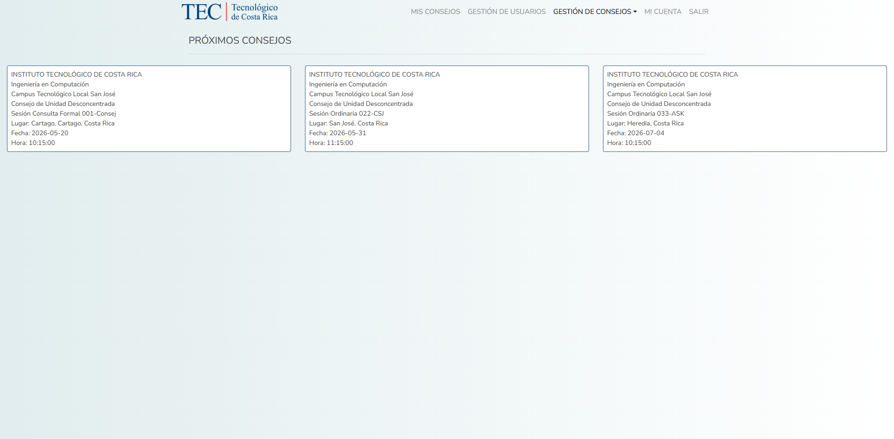
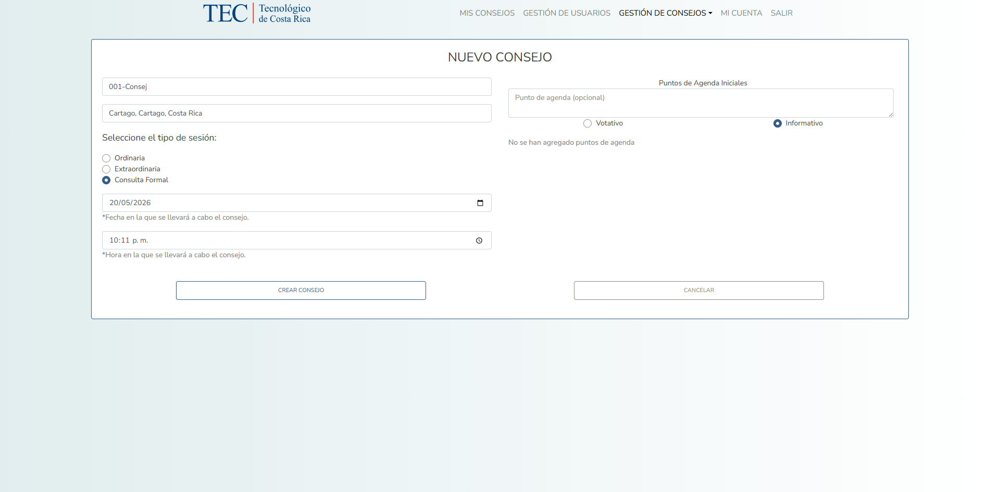
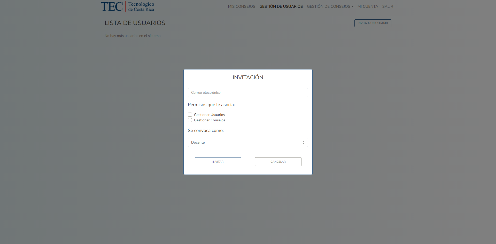
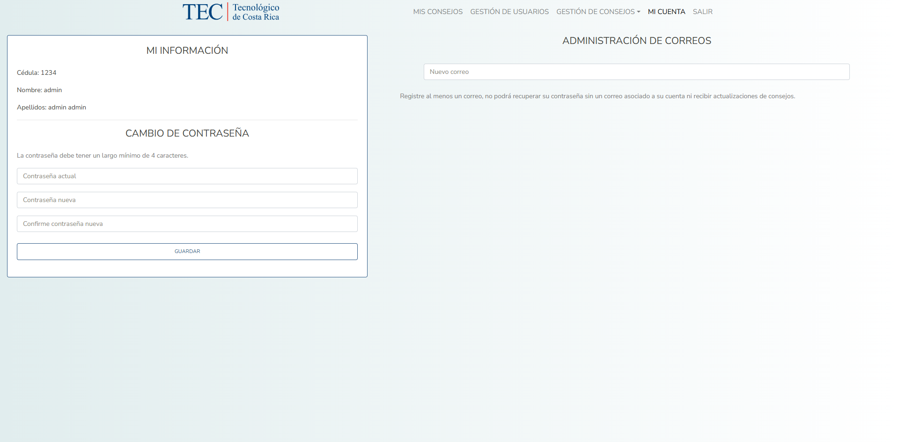

# Il Consigliere

A full-stack institutional council management platform designed to streamline council session administration, secure user onboarding, agenda organization, and voting workflows.

Built as a web-based solution for academic council management (2023), enabling role-based access control and secure session coordination.

---

## Overview

Il Consigliere is a full-stack web application developed to digitize and optimize institutional council processes.

The platform enables administrators to:

- Manage council sessions
- Organize agendas and discussion points
- Invite participants securely
- Control role-based access
- Handle voting workflows
- Manage user authentication and recovery

The system was designed around real institutional requirements, emphasizing security, structured workflows, and administrative control.

---

## Features

### Authentication & Security

- JWT-based authentication
- Secure password hashing
- Protected routes
- Session validation
- Role-based access control

---

### User Management

- Invite-only user registration
- Role assignment during invitation
- User account management
- Password recovery via email

Supported roles:

- Administrator
- Professor
- Student

---

### Council Administration

- Create and manage council sessions
- Register attendees
- Organize official agendas
- Manage discussion points
- Track voting processes

---

### Workflow Automation

- Email invitation system
- Password reset email flow
- Token-based account activation
- Access expiration controls

---

## Tech Stack

### Frontend

- React
- React Router
- Axios
- Bootstrap

### Backend

- Node.js
- Express.js
- Sequelize ORM
- JWT Authentication
- Nodemailer

### Database

- PostgreSQL

---

## Architecture

The project follows a modular full-stack architecture:

```
Frontend (React SPA)
↓
REST API (Express)
↓
Business Logic Controllers
↓
Sequelize ORM
↓
PostgreSQL
```

Backend structure includes:

- Controllers
- Routes
- Database models
- Migrations
- Seeders

---

## Key Technical Highlights

### Role-Based Access Control

Implemented permission-based authorization to restrict functionality depending on user role.

---

### Secure Invitation Flow

Users cannot self-register.

Accounts are created through administrator-generated invitation links with expiration controls.

---

### Password Recovery

Tokenized password recovery flow with time-limited reset links delivered via email.

---

### Database-Driven Workflow Management

Council entities, attendees, permissions, session types, and voting structures are fully relationally modeled using PostgreSQL.

---

## Screenshots

### Home Page



### Login



### Password Restauration Via Email



### Dashboard



### Council Management



### User Invitation



### User Administration



---

## Local Setup

### Backend

```bash
cd Il-Consigliere-master
npm install
npm run dev
```

---

### Frontend

```bash
cd Il-Consigliere-Front-End-master
npm install
npm start
```

---

### Environment Variables

Create a `.env` file:

```env
DB_USER_DEV=
DB_PASS_DEV=
DB_NAME_DEV=
DB_HOST_DEV=
PORT=5000
KEY=
EMAIL=
EMAIL_PASS=
```

---

### Database

Run migrations and seeders:

```bash
npx sequelize-cli db:migrate
npx sequelize-cli db:seed:all
```

---

## Authors

Keylor Calderón, Jailine González, Luis Chavarría and Junior Segura

---

## What I Learned

Through this project I strengthened practical experience in:

- Full-stack application architecture
- REST API development
- Authentication and authorization
- Relational database modeling
- Email workflow integration
- Secure token handling
- Building business-oriented software solutions

---

## Future Improvements

- Upgrade React and backend dependencies
- Improve UI/UX responsiveness
- Add automated testing
- Containerize with Docker
- Deploy cloud-hosted demo
